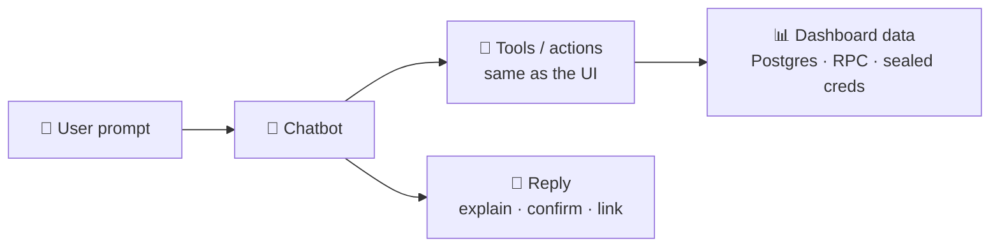
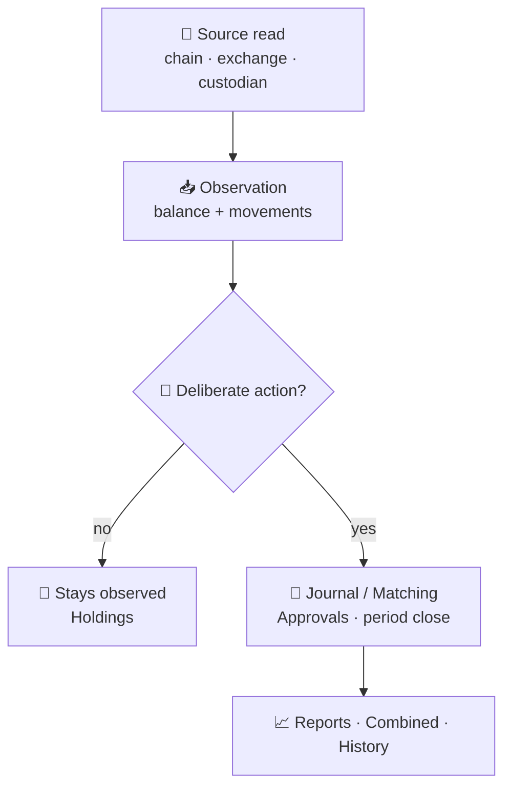
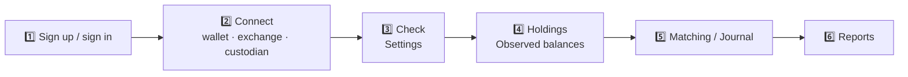
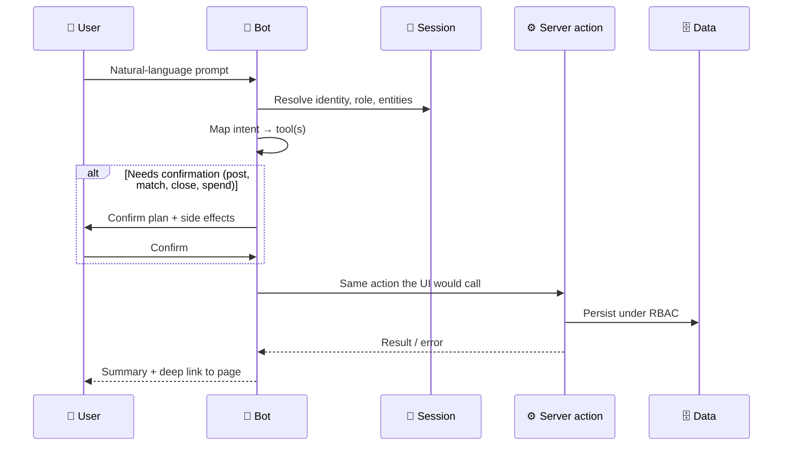
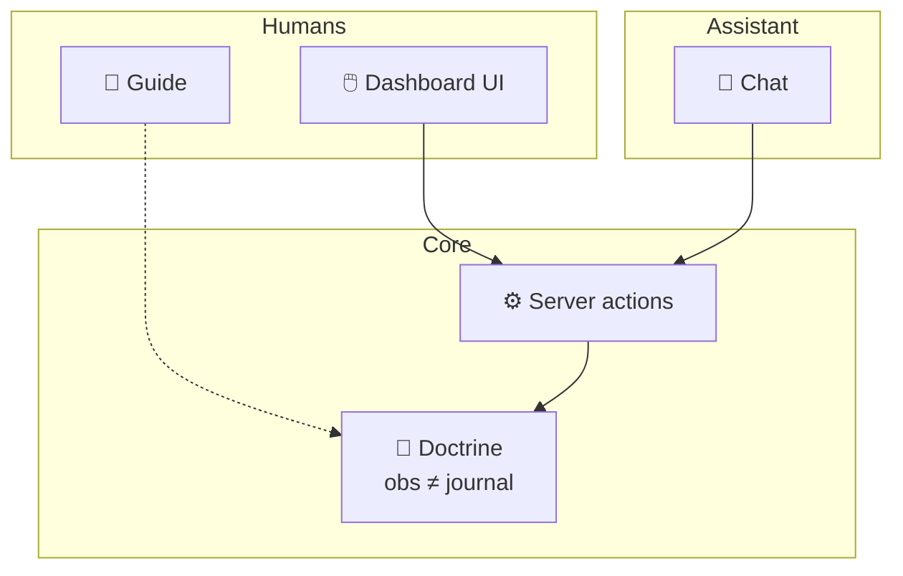

# 🤖 Token Ledger AI Chatbot

> **Product vision:** a conversational assistant that can do **anything a signed-in user can do** in the dashboard — when prompted — while respecting roles, entity scope, and the ledger doctrine.

This document is the capability handbook for the chatbot: what it can explain, what it can *do*, how requests flow, and what it must refuse. It is written for product, eng, and future prompt / tool grounding.

---

## 📑 Table of contents

1. [Why this exists](#1--why-this-exists)
2. [Product doctrine](#2--product-doctrine)
3. [First-run path](#3--first-run-path)
4. [Capability map](#4--capability-map)
5. [How a prompt becomes an action](#5--how-a-prompt-becomes-an-action)
6. [Example prompts](#6--example-prompts)
7. [Roles & permissions](#7--roles--permissions)
8. [Hard refusals](#8--hard-refusals)
9. [Surface map](#9--surface-map)
10. [Related docs](#10--related-docs)

---

## 1. ✨ Why this exists

Token Ledger already consolidates wallets, exchanges, custodians, and books into one double-entry subledger. Users still have to *find* the right page and remember the Connect → Check → Holdings → Matching → Reports path.

The chatbot is the same product, spoken:

| Without chat | With chat |
| --- | --- |
| Click **Settings → Check** | “Check my Coinbase connection” |
| Open **Reports**, pick period, export | “Generate last month’s trial balance as CSV” |
| Hunt exceptions on **Matching** | “Match the unmatched USDC deposits for Harbourline” |
| Guess what “Waiting” means | “Why is this connection still Waiting?” |

It does **not** invent a second accounting system. It drives the existing dashboard actions under the user’s session.

---

## 2. 🧭 Product doctrine

These rules are non-negotiable for humans *and* the assistant:

1. **👀 Observations ≠ journals.** A Check stores balances and movements. It never posts a journal entry.
2. **🔒 Connections are read-only.** Watch wallets, exchange viewers, custodian viewers — no trading or withdrawals through Token Ledger.
3. **✍️ Posts are deliberate.** Journal lines, matches, period close, and revaluation require an intentional action (and often Approval).
4. **🏢 Scope is entity + org.** The bot only sees companies the session can access.
5. **🪪 Permissions travel with the session.** Owner/admin/accountant/approver/viewer/onboarding — the bot cannot escalate.

---

## 3. 🚀 First-run path

The assistant should coach this path the same way the Guide does:

| Step | What “done” looks like | Common pitfall |
| --- | --- | --- |
| 🔌 Connect | Connection exists (often **Waiting**) | Expecting coins immediately |
| ✅ Check | Status healthy; observations stored | Skipping Check after Coinbase OAuth |
| 💼 Holdings | Coins on **Observed balances** | Looking only at Overview KPIs |
| 🔗 Matching | Source facts linked (or exceptions listed) | Auto-match without reviewing |
| 📊 Reports | Trial balance / statements export | Reporting before anything is posted |

---

## 4. 🗺️ Capability map

Anything the user can do in the UI is a valid chatbot skill — gated by permission.

### 4.1 🏦 Books & companies

| Capability | Dashboard | Example prompt |
| --- | --- | --- |
| Org overview | Overview | “Summarize Harbourline’s books this month” |
| Companies | Companies | “Add a Singapore subsidiary” |
| Chart / accounts | Holdings · Journal | “List asset accounts with booked crypto” |

### 4.2 🔌 Sources & holdings

| Capability | Dashboard | Example prompt |
| --- | --- | --- |
| Add connection | Settings / Setup | “Connect a Solana watch wallet …” |
| Check / refresh | Settings · Holdings | “Check all Waiting connections” |
| Observed balances | Holdings | “What did Coinbase report for USDC?” |
| CSV import | Holdings | “Import this exchange CSV” |
| Market prices | Holdings | “Refresh market prices” |

### 4.3 📘 Journal & approvals

| Capability | Dashboard | Example prompt |
| --- | --- | --- |
| Prepare / post | Journal | “Draft a journal for yesterday’s deposits” |
| Approve | Approvals | “Approve the pending drafts I didn’t prepare” |
| Reverse | Journal | “Reverse entry JE-1042 with a note” |

### 4.4 🔗 Matching & close

| Capability | Dashboard | Example prompt |
| --- | --- | --- |
| Auto / manual match | Matching | “Match unmatched Solana USDC movements” |
| Unmatch | Matching | “Unmatch this pair — wrong invoice” |
| Close / reopen period | Matching | “Close March 2026 for Harbourline” |

### 4.5 📊 Reports & consolidation

| Capability | Dashboard | Example prompt |
| --- | --- | --- |
| Trial balance / statements | Reports | “Generate Q1 P&L PDF” |
| Crypto schedule | Reports | “Export the crypto holdings schedule as CSV” |
| Revaluation | Reports | “Post month-end FX revaluation” |
| Combined (IAS 21 view) | Combined | “Show consolidated assets in USD” |

### 4.6 ⛓️ On-chain (Solana execution)

Separate mental model from read-only books — money can move on-chain.

| Capability | Dashboard | Example prompt |
| --- | --- | --- |
| Billing vault | Billing | “Show my subscription vault balance” |
| Treasury | Treasury | “List approved suppliers” |
| Payables | Payables | “Propose payment for invoice INV-88” |

### 4.7 🛠️ Ops, people, settings

| Capability | Dashboard | Example prompt |
| --- | --- | --- |
| Sync health | Operations | “Why did the last BitGo sync fail?” |
| Audit trail | History | “Who closed the period yesterday?” |
| Users | Users | “Invite an accountant on viewer-scoped entities” |
| Onboarding tabs | Onboarding | “Hide Billing for the onboarding role” |
| Account | Settings | “Rotate my password” / “Disconnect Kraken” |

---

## 5. 🔄 How a prompt becomes an action

**Design rules for tools**

- Prefer **one user-visible action** per turn when money or books change.
- Always return a **deep link** (`/dashboard/reconciliation`, etc.).
- For destructive or irreversible steps (reverse, period close, on-chain settle), require an explicit confirmation utterance.
- Never bypass Approvals when the role requires them.

---

## 6. 💬 Example prompts

### 🌱 Getting started

- “I connected Coinbase — why don’t I see coins?”
- “Walk me through Connect → Check → Holdings.”
- “Restart the getting-started tour.”

### 📈 Reporting

- “Generate last month’s trial balance for Harbourline.”
- “Export the balance sheet and P&L as PDF.”
- “What’s our booked crypto value vs observed?”

### 🔗 Matching

- “Show unmatched movements this week.”
- “Auto-match where amounts and dates agree.”
- “Close February once matching is clean.”

### 👀 Explain-only (viewer-safe)

- “Explain the Waiting status on this connection.”
- “What does Observed balance mean?”
- “Summarize recent audit events.”

---

## 7. 🪪 Roles & permissions

| Role | Bot may… | Bot must not… |
| --- | --- | --- |
| 👑 Owner | Full org actions + users | — |
| 🛡️ Admin | Sources, users, most ops | Escalate beyond admin matrix |
| 🧮 Accountant | Journal, match, reports | Approve own drafts (unless owner override) |
| ✅ Approver | Approve drafts | Post as preparer without permission |
| 👀 Viewer | Explain + read reports in scope | Write books, match, check, invite |
| 🐣 Onboarding | See allowed tabs only | Reveal hidden sections |

The chatbot is **not** a privilege Escalator. If the UI button is hidden for the role, the tool is unavailable.

---

## 8. 🚫 Hard refusals

The assistant **must refuse** (and explain why):

| Refusal | Reason |
| --- | --- |
| ❌ Sign transactions / move funds off read-only connectors | Product is read-only for sources |
| ❌ Invent journal entries that were never posted | Observations ≠ books |
| ❌ Bypass period close or Approvals | Control environment |
| ❌ Reveal sealed API secrets or raw credentials | Security |
| ❌ Act on entities outside session scope | Multi-tenant isolation |
| ❌ Mainnet spend without explicit on-chain UX confirmation | Treasury / payables / billing |

---

## 9. 🖥️ Surface map

| Surface | Job |
| --- | --- |
| 📖 In-app **Guide** (`/dashboard/guide`) | Human-readable TOC handbook + animated flows |
| 🤖 Chat panel *(planned)* | Same capabilities via tools |
| 📄 `docs/ai-chatbot.md` (this file) | Spec for eng / prompts / evals |
| 🔀 `docs/flowchart.md` | System Mermaid for ingestion & ledger |

---

## 10. 📚 Related docs

- [`docs/flowchart.md`](./flowchart.md) — end-to-end system flows
- [`docs/adr-accounting-sync.md`](./adr-accounting-sync.md) — sync / idempotency
- [`docs/adr-report-pdf.md`](./adr-report-pdf.md) — report exports
- [`docs/adr-solana-contracts.md`](./adr-solana-contracts.md) — on-chain billing & treasury
- [`docs/design-system/motion.md`](./design-system/motion.md) — motion rules for Guide animations
- In-app: `/dashboard/guide`

---

*Observations stay observed. Journals stay deliberate. The chatbot speaks the product — it does not rewrite it.*
