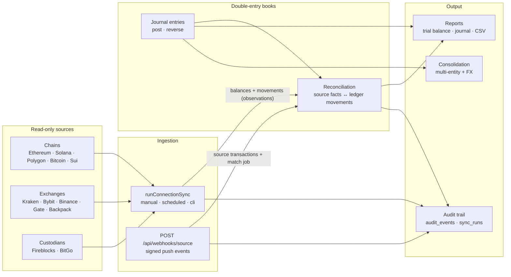
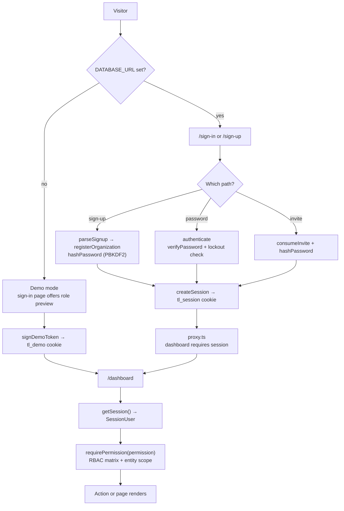
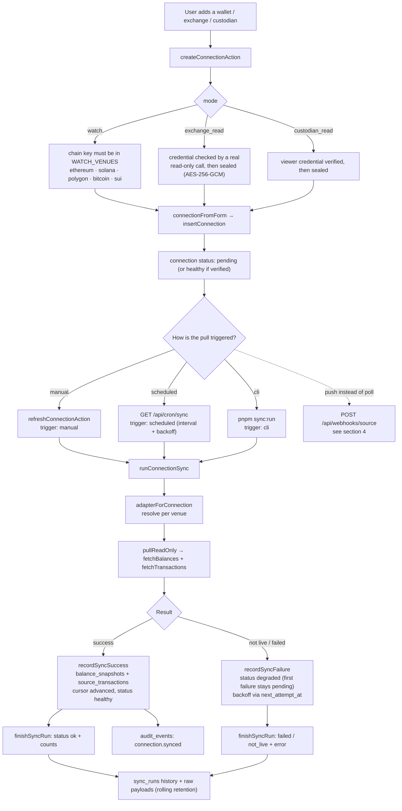
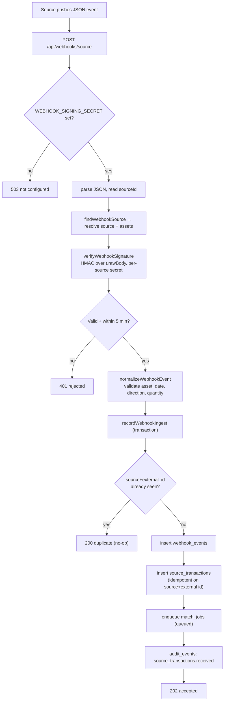
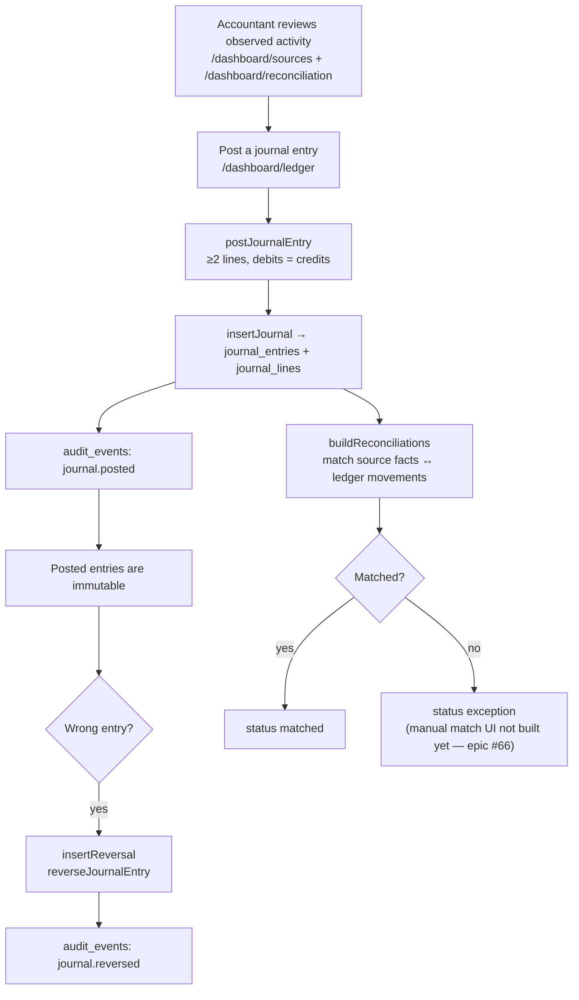
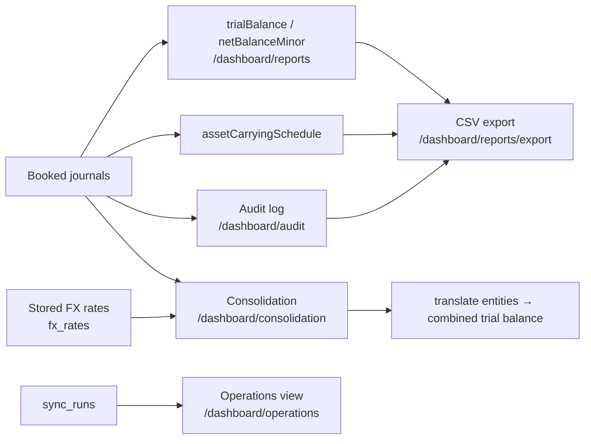
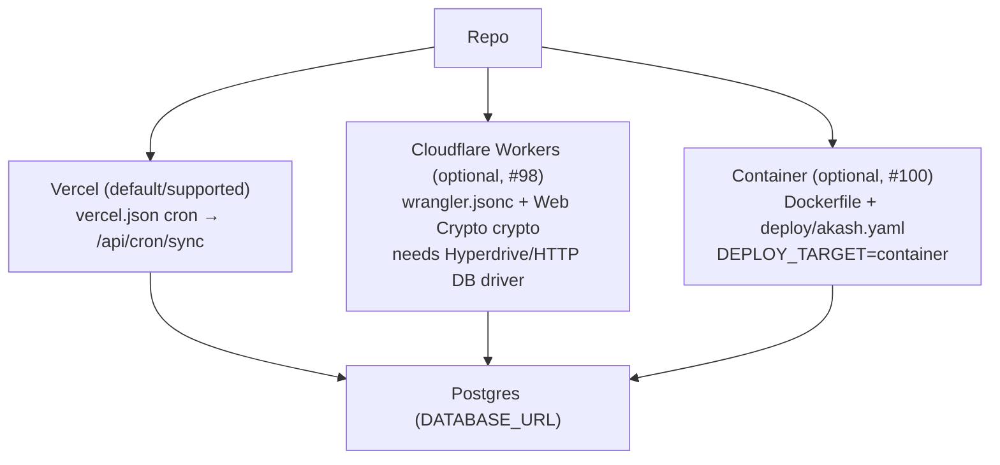

# Token Ledger — flow charts

End-to-end flows through the system. Diagrams are Mermaid; GitHub renders them
inline. The guiding rule throughout: **reads are observations, writes to the
books are deliberate, and nothing pulled from a source ever posts a journal.**

---

## 1. System at a glance

---

## 2. Authentication and session

Notes: the signed-in identity is isolated in `getSession()`; swapping in
Privy/Crossmint would only change how a `SessionUser` is produced. RBAC and
entity scoping stay.

---

## 3. Adding a connection and syncing

Key point: `recordSyncSuccess` writes **observations only** — balances and source
transactions. It never inserts a journal entry.

---

## 4. Signed event ingestion (webhooks)

---

## 5. Posting to the books and reconciling

The separation is deliberate: pulls create **observed** facts; journals create
**booked** value; reconciliation proves the two agree. That is the audit trail.

---

## 6. Reporting, consolidation, and audit

---

## 7. Deployment targets

---

## 8. The one-sentence summary

A user signs in, connects read-only sources across chains/exchanges/custodians,
records what they hold, then deliberately journals and reconciles it — while
every pull, event, post, and reversal is written to an auditable history.
